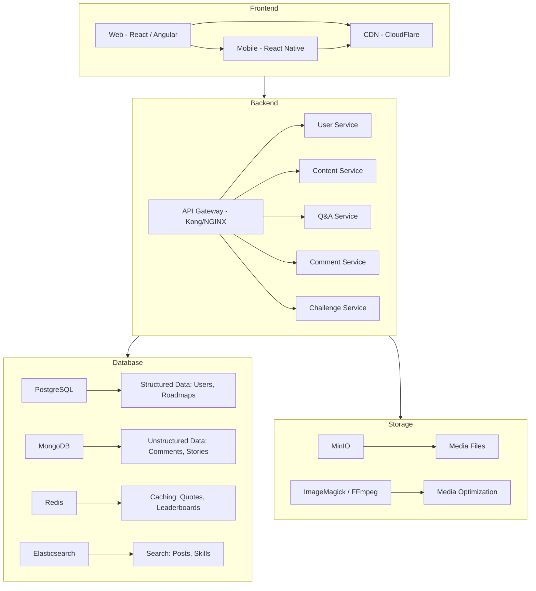

# High Level Architecture



# Microservices interaction


# Data FLow for Key Features


# Deployment Pipeline


# Security Layer 


# Tools and Libraries Flow
```mermaid
graph LR
  A[Authentication] --> Keycloak, JWT, OAuth2
  B[Search] --> Elasticsearch, Apache Solr
  C[Real-Time] --> Socket.io, MQTT - for lightweight messaging
  D[Moderation] --> PerspectiveAPI - toxicity detection, custom rules engine
  E[Analytics] --> Matomo
  F[Notifications] --> Firebase Cloud Messaging - FCM, self-hosted Gotify
```
